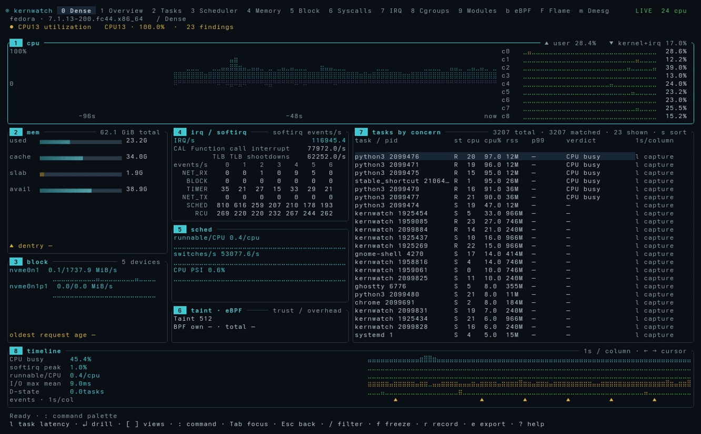
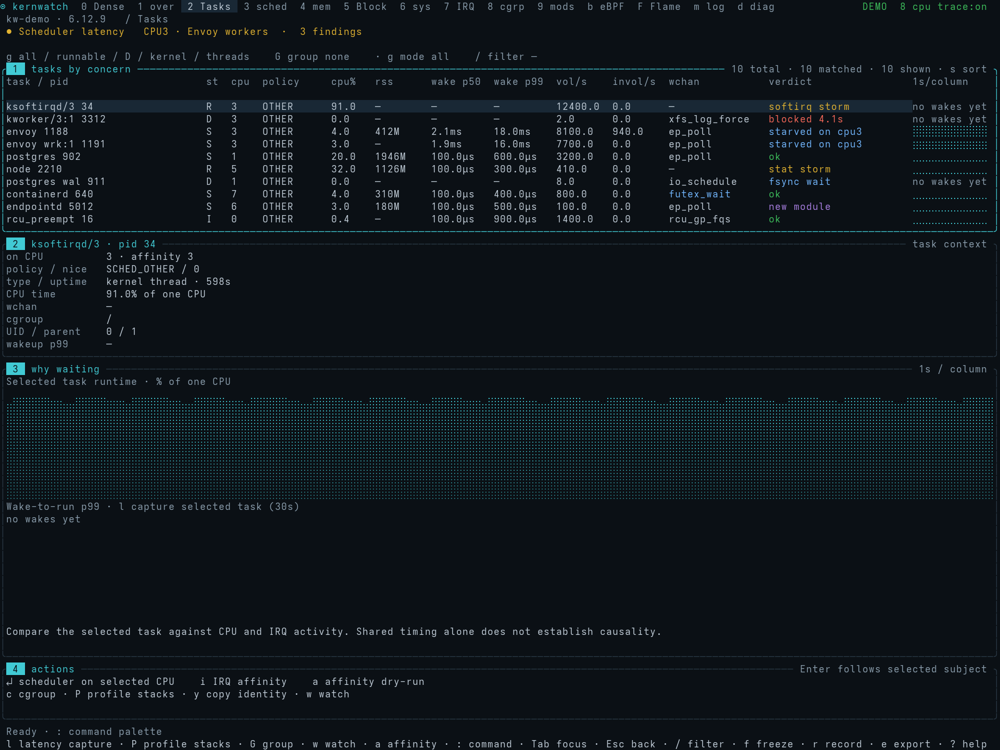
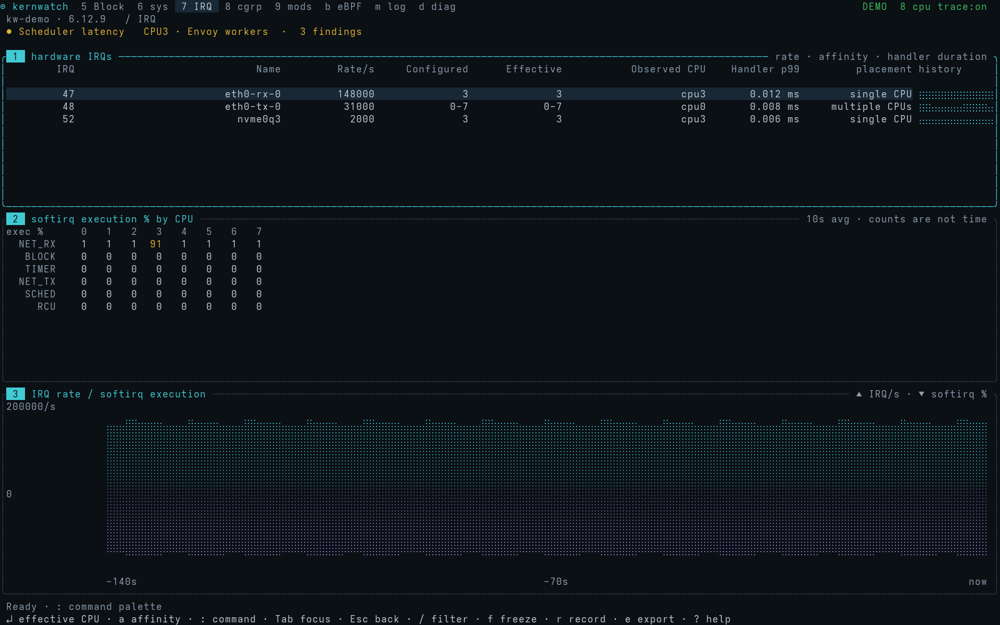
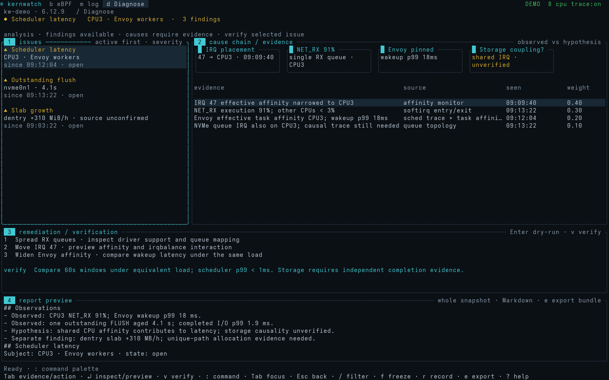

# kernwatch

**Linux kernel observability, in your terminal.**

kernwatch is a Rust + Ratatui monitor for investigating CPU contention, task scheduling, memory pressure, block I/O, interrupts, cgroups, kernel modules, and eBPF activity. Thirteen connected views bring live counters, bounded tracing, timelines, and incident evidence into one keyboard-driven interface.



*Recorded against a live host under a generated workload — real counters, real task list, real kernel log. The synthetic [guided tour](docs/DEMO.md) is a separate mode. Live mode does not substitute demo values for missing measurements.*

[Demo](#demo) · [Quick start](#quick-start) · [Views](#views) · [Controls](#controls) · [Tracing](#tracing) · [Development](#development) · [Limitations](#limitations)

## What it does

- **Monitor without tracing:** CPU components, task runtime, memory and pressure, disk activity, IRQ/softirq counters, cgroups, and loaded modules.
- **Investigate latency:** optional CO-RE eBPF captures measure wake-to-run delay, off-CPU intervals, IRQ handler duration, syscall duration, and block request completion.
- **Follow the evidence:** move between a task, its CPU and cgroup, related events, and diagnosis. Observations and hypotheses remain distinct.
- **Keep context:** freeze the display, inspect history, record a session, replay it offline, and export a structured incident report.
- **Inspect deeper metadata:** optional systemd properties/drop-ins, module file metadata, SMART health, journal records, and BPF program/link information.
- **Review changes before applying:** supported task, IRQ/RPS, and cgroup controls use explicit previews, target identity checks, readback, and rollback journals.

kernwatch is Linux-only. It runs on x86-64 and ARM64, as glibc or static musl builds, and supports live counters, optional eBPF, demo, recording and replay. The macOS and Windows demo/replay viewers were removed in 0.3.0; they collected no kernel telemetry and applied no host controls.

kernwatch is under active development. The [gap audit](docs/GAPS.md) and [requirement ledger](docs/COMPLETION.md) distinguish implemented features, environment restrictions, and remaining work.

## Demo

Explore a simulated scheduling incident across nine views: Dense → Tasks → Scheduler → IRQ → Memory → Block → Cgroups → eBPF → Diagnose. The tour connects delayed Envoy workers with CPU placement, interrupt activity and resource pressure, then presents evidence for investigation.

```sh
./target/release/kernwatch --demo-tour
```

The tour loops every **40 seconds**. Press any key to take manual control, `0` to open Dense, or `q` to quit. For the full presentation, use a **160×52** terminal.

Demo mode needs no administrator privileges, starts no host probes and does not change host controls. Run `--demo` for manual exploration. The preview above comes from the actual Ratatui renderer. See the [demo guide](docs/DEMO.md) for the scene walkthrough and preview generation.

## Quick start

### Download a binary

Get prebuilt binaries from [GitHub Releases](https://github.com/matthart1983/kernwatch/releases/latest). Linux builds are available for x86-64 and ARM64, with glibc and static musl variants. Static musl builds are recommended for portability. Downloads are public.

With GitHub CLI authenticated:

```sh
gh release download --repo matthart1983/kernwatch --pattern 'kernwatch-linux-x86_64-static.tar.gz*'
sha256sum --check kernwatch-linux-x86_64-static.tar.gz.sha256
tar -xzf kernwatch-linux-x86_64-static.tar.gz
mkdir -p ~/.local/bin
install -m 755 kernwatch-linux-x86_64-static ~/.local/bin/kernwatch
~/.local/bin/kernwatch --demo-tour
```

Archives include the executable, license and README. Static linking removes the glibc requirement; live tracing still depends on kernel features and permissions.

### Build from source

Requirements: **Linux x86-64 or ARM64**, **Rust 1.98 or newer**, and a C linker. Internet access is needed for the first dependency download.

Clone the repository and build:

```sh
git clone https://github.com/matthart1983/kernwatch.git
cd kernwatch
cargo build --release --locked
```

Monitor the current host:

```sh
./target/release/kernwatch --view dense
```

Install the executable into your user account:

```sh
mkdir -p ~/.local/bin
install -m 755 target/release/kernwatch ~/.local/bin/kernwatch
~/.local/bin/kernwatch
```

The checked-in BPF object is embedded in the executable. A BPF-capable Clang is needed only when rebuilding the probe source. Building locally uses your system's C library; copied binaries may require a newer glibc than another host provides.

### Terminal size

Use **160 columns** for the full dashboard. Compact layouts work at **80×24**, including IRQ and Scheduler panels in Dense. Focus and expand a panel to inspect details at smaller sizes.

## Views

| Key | View | Focus |
|:---:|---|---|
| `0` | **Dense** | CPU, memory, block I/O, IRQ, scheduler, modules/BPF, tasks, and timeline |
| `1` | Overview | Host health and leading findings |
| `2` | Tasks | Threads, placement, runtime, memory, and captured wake latency |
| `3` | Scheduler | CPU/task/cgroup scheduling and latency distributions |
| `4` | Memory | Process memory, slab, NUMA, hugepages, and reclaim |
| `5` | Block | Device throughput, queue activity, and captured request latency |
| `6` | Syscalls | Calls, negative returns, durations, arguments, and captured stacks |
| `7` | IRQ | Interrupt rates, affinity, per-CPU softirq data, and handler latency |
| `8` | Cgroups | Runtime, quota, placement, memory, and pressure |
| `9` | Modules | Loaded state, taint, file metadata, and observed changes |
| `b` | eBPF | Programs, maps, links, runtime counters, and capture overhead |
| `m` | Dmesg | Kernel/journal events and source health |
| `d` | Diagnose | Evidence, hypotheses, action previews, and verification |

<details>
<summary>More screenshots</summary>

### Tasks



### IRQ



### Diagnose



</details>

## Controls

| Key | Action |
|---|---|
| `Tab` / `Shift-Tab` | Move panel focus |
| `Alt+1` … `Alt+9` | Focus a numbered panel |
| `[` / `]` | Previous / next view |
| Arrows or `j` / `k` | Navigate rows; left/right moves the time cursor |
| `Enter` / `Esc` | Inspect or drill in / return |
| `Space` | Expand a focused panel; fold cgroups where applicable |
| `/` | Filter |
| `s` / `S` | Choose sort field / reverse sorting |
| `f` | Freeze the display |
| `r` / `e` | Toggle recording / export an incident report |
| `l` in Tasks or Dense | Capture the selected task's wake latency for 30 seconds |
| `:` | Open the command palette |
| `?` / `q` | Help / quit |

The footer shows context-specific shortcuts. Enter `capabilities` in the command palette to see collector status and acquisition errors.

## Tracing

Ordinary counters use procfs/sysfs. Wake-latency percentiles, syscall durations, and request-level I/O latency require an explicit capture and kernel BPF permissions. Collection failures are reported in the status line and persist on an empty Syscalls tab; kernwatch does not elevate itself.

On Syscalls (`6`), press `l` to collect for 30 seconds and `x` to stop. Opening the tab alone does not start tracing. A thread-specific capture uses `:probe syscalls pid=TID seconds=30`.

To run a bounded capture with administrator privileges:

```sh
sudo ./target/release/kernwatch --trace
```

`--trace` starts all supported probe families for 30 seconds. In the command palette, choose a narrower capture:

```text
probe sched seconds=30
probe offcpu seconds=10
probe irq seconds=10
probe block seconds=20
probe syscalls pid=1188 seconds=10
probe syscalls pid=1188 stack seconds=10
probe syscalls cgroup=/system.slice/example.service seconds=10
stop-probe
```

`pid=` is a **thread ID**, not an entire process. Task scope applies to scheduler/syscall capture; cgroup scope applies to syscalls. Durations are limited to **1–60 seconds**. User-stack capture requires a selected thread.

### Reading the measurements

- Wake latency and off-CPU time describe different intervals. The latter includes sleeping as well as runnable waiting.
- Percentiles use bounded retained samples. They are not unlimited whole-population distributions.
- Softirq event counts are not CPU execution percentages; the interface labels their units separately.
- Device mean latency is not request p99. Timeline fallbacks retain distinct labels.
- Missing, warming, stopped, denied, and stale values are not healthy zeroes. Ring-buffer loss invalidates pending correlations and degrades affected measurements.
- Current task latency histories include task start identity, so a recycled PID does not reuse a previous task's graph.

## Recording and reports

Press `r` to start/stop a recording, then replay it without sampling the host:

```sh
./target/release/kernwatch --replay capture.kwr
./target/release/kernwatch --replay capture.kwr --at 600000 --snapshot
```

Use left/right to seek. The command palette supports `play`, `pause`, and `speed 0.1` through `speed 16`. Freezing the display does not stop recording.

Press `e` to export eight files:

```text
environment.json   snapshot.json   report.json   report.md
events.json        series.json     actions.json  manifest.json
```

Exports preserve source quality, observations, hypotheses, and action records. A completed report directory is published atomically. Recordings and reports can contain host/workload details; they are excluded from Git by default.

Settings and baselines live under `$XDG_STATE_HOME/kernwatch`, or `~/.local/state/kernwatch` when that variable is unset. Existing `.kwr` recording format compatibility is retained from the project's earlier `kwatch` name.

## Optional data sources

| Source | Requirements |
|---|---|
| Scheduler and request-level tracing | Kernel BTF, supported tracepoints, and BPF permissions |
| Systemd metadata | `systemctl` and access to the appropriate manager bus; file fallback has a narrower scope |
| Module file metadata | `modinfo` and the matching installed module files |
| SMART / NVMe health | `smartctl`, a supported device, and device access |
| Kernel/audit journal | `journalctl` and journal permissions; audit records require an existing audit source |
| BPF helper symbol names | Permission to inspect translated instructions and visible kernel symbols |

Slow enrichment runs on independent workers with bounded requests, output limits, deadlines, and caches. Inspectors show metadata sample age.

## Development

```sh
cargo fmt --check
cargo clippy --locked --all-targets -- -D warnings
cargo test --locked
cargo build --release --locked
python3 scripts/pty_smoke.py
python3 scripts/demo_smoke.py
```

The tests cover parsing, task identity, navigation, replay, reports, action workflows, and Ratatui layout buffers. The GitHub Actions workflow is configured for these checks, including terminal and guided-demo smoke tests. Local validation passes all 74 Linux tests, formatting, Clippy and both smoke scripts. Privileged kernel validation is separate; see [validation evidence and its scope](docs/VALIDATION.md).

Rebuild the embedded probes after changing their C source:

```sh
CLANG=clang sh probes/build.sh
cargo build --release --locked
```

Refresh the thirteen rendered reference buffers and screenshots after intentional UI changes:

```sh
python3 scripts/capture_all.py
```

Screenshot rendering also needs Pillow and either Adwaita Mono or DejaVu Sans Mono. Review the images before accepting changed layout baselines. See [CONTRIBUTING.md](CONTRIBUTING.md) for the development workflow.

## Limitations

The pre-rename baseline passed tracing tests on Linux x86-64 kernels **6.19.10** and **7.1.13** in disposable VMs. The renamed build has not repeated those privileged tests. The ARM64 CO-RE probe and syscall decoder use the ARM64 register ABI; privileged ARM64 probe attachment has not yet been validated. Compatibility with other kernels, drivers and security policies needs separate validation.

Remaining work includes user-stack symbolization, allocation and module-loader attribution, a supported interactive tracefs fallback, BPF map occupancy/FD-holder attribution, and cross-suspend alignment of historical log timestamps. CPU/runtime counters cannot reconstruct missing historical events or establish causality on their own.

See the [Syscalls/eBPF review](docs/SYSCALL_EBPF_REVIEW.md) for the latest tab findings and the [gap audit](docs/GAPS.md) for scope and the [specification](docs/SPEC.md) for the intended product.

## License

[MIT](LICENSE).
